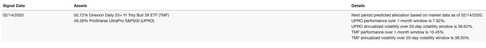
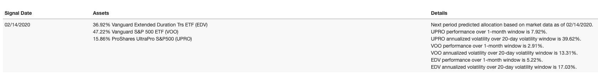

# inverse_volatility_caculation
This is to help people get forward signal of their inverse volatility allocation strategy. https://www.portfoliovisualizer.com/ used to provide this for free, but now it requires a subscription.

If you are interested why this may help build your portfolio, see https://quantdare.com/risk-parity-versus-inverse-volatility/

## Preparation
```
pip3 install numpy
pip3 install requests
```

## Example Usage
```
./inverse_volatility.py
Profolio: ['UPRO', 'TMF'], as of 2020-02-15 (window size is 20 days)
UPRO allocation ratio: 49.09%, anualized volatility: 39.87%, performance: 5.36%
TMF allocation ratio: 50.91%, anualized volatility: 38.45%, performance: 11.64%
```

Checking against Portfolio Visualizer: 

```
Profolio: ['UPRO', 'VOO', 'EDV'], as of 2020-02-15 (window size is 20 days)
UPRO allocation ratio: 15.79% (anualized volatility: 39.87%, performance: 5.36%)
VOO allocation ratio: 47.22% (anualized volatility: 13.33%, performance: 2.06%)
EDV allocation ratio: 36.98% (anualized volatility: 17.03%, performance: 5.63%)
```

Checking against Portfolio Visualizer: 

## Note

Data source: https://finance.yahoo.com/quote/VOO/history?p=VOO -> Historical Data -> Download Data

Note that the cookie in the code may expire that you need to update the `crumb` parameter in the url along with your cookie from browser accordingly.
